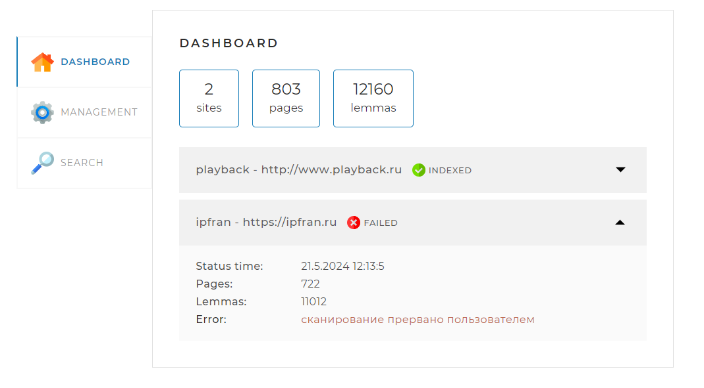
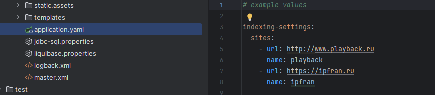
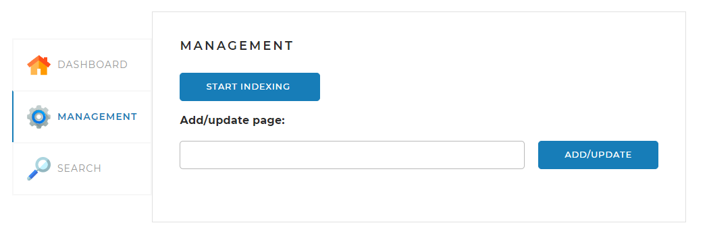
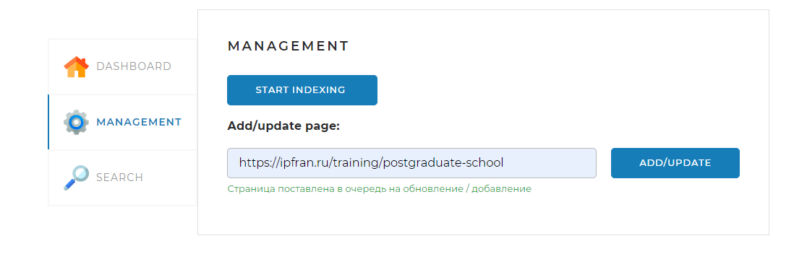
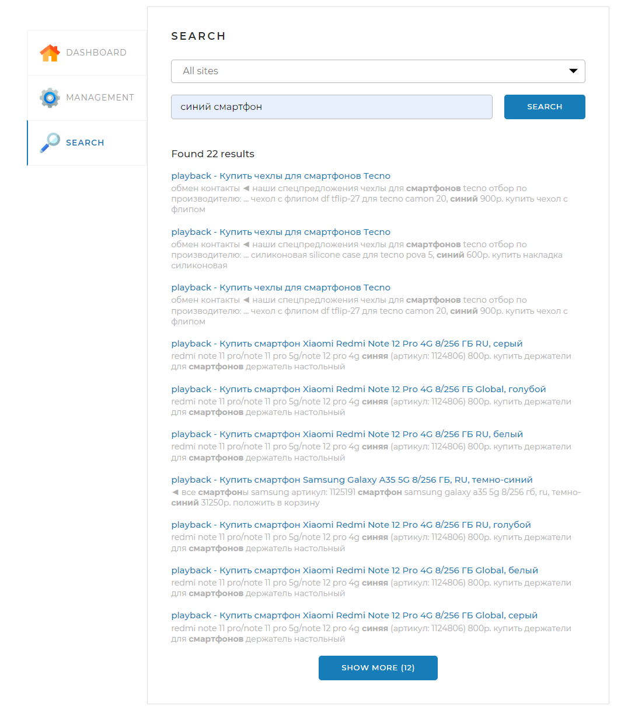
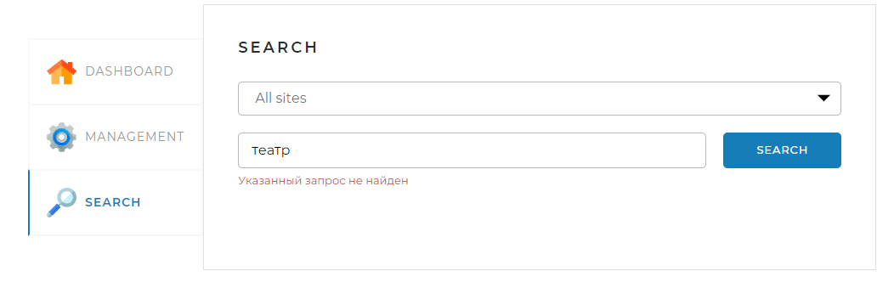

# Поисковый движок для персонального сайта

Данный поисковый движок позволяет:
* организовать поиск по страницам одного или нескольких сайтов
* динамически проводить переиндексацию отдельных страниц
* видеть статистику индексации в простом и понятном виде

## Информационный дэшборд

На главной странице расположен информационный дэшборд, который отображает:
* количество проиндексированных сайтов в базе (в данном случае 2)
* количество проиндексированных страниц с этих сайтов в базе (в данном случае 803)
* количество созданных лемм на основании проиндексированных страниц (в данном случае 12160)
* перечень сайтов в базе с указанием последнего статуса индексации, количества страниц и лемм. (в данном случае индексация остановлена пользователем, что отражено в статусе у второго сайта)

## Как настроить перечень сайтов для поиска

Настройка сайтов для индексации осуществляется через конфигурирование файла application.yaml. В параметре:
indexing-settings.sites необходимо указать перечень адресов сайтов и их имен: 

## Как запустить индексацию набора сайтов?

После того как конфигурирование завершено, можно запускать индексирование сайтов. Для этого необходимо 
нажать кнопку "start indexing"

К сожалению, в этой части система динамически не опредяляет прогресса. Есть три варианта, как смотреть прогресс сканирования:
* на вкладке dashboard, периодически обновляя страницу
* можно делать селект непосредственно в базе в таблице SITE, если есть доступ к базе
* либо по файлу с логами (в корневой папке проекта папка logs) 

Если нужно прервать сканирование дострочно, то можно нажать кнопку "stop indexing", тогда:
* все завершенные задачи индексирования сохранятся
* новые задания будут помечены как прерванные
* индексация текущего сайта и всех сайтов в очереди будет помечена как прерванная

## Как запустить индексацию отдельной страницы?

Если необходимо переиндексировать одну страницу, то нужно указать полный ее путь, нажать "ADD/UPDATE" и затем "start indexing".
Тут важно отметить, что если попробовать добавить вторую страницу для индексации, то первая будет заменена. Т.е. выборочная индексация произваодится только по 1 странице.
Когда будет запущена индексация - то она произойдет только по 1 странице.

Если добавляемая страница находится за пределами доменов, указаных в application.yaml, то система выдаст ошибку и не будет сканировать страницу.

## Как выглядит процесс поиска?

После того, как настройки завершены и страницы проиндексированы, можно использовать поиск. Для этого 
на вкладке поиска можно ввести интересующий запрос и нажать "SEARCH":

По умолчанию выводится 10 результатов поиска. Остальные результаты доступны по кнопке "MORE". Если по запросу ничего не найдено
на указанных сайтах, то выводится сообщение об отсутствии данных:

## Используемые технологии

Приложение является достаточно стандартным spring boot web application и для его создания использовались следующие технологии:
* java 17
* spring boot framework как каркас приложения
* org.apache.lucene.morphology как леммаизатор
* jsoup для парсинга веб-страниц
* thymeleaf как стандартный шаблонизатор для страниц
* hibernate для стандартных сущностей
* jdbcTemplate и пакетная вставка/выборка для больших объектов
* lombok library для сокращения кода
* mysql db для хранения результатов
* liquibase для создания страниц и управления их версиями
* logback для организации системы логирования

## Дополнительная информация

Будем рады вашим замечаниям и предложениям.

Created by: Lunev Sergey
